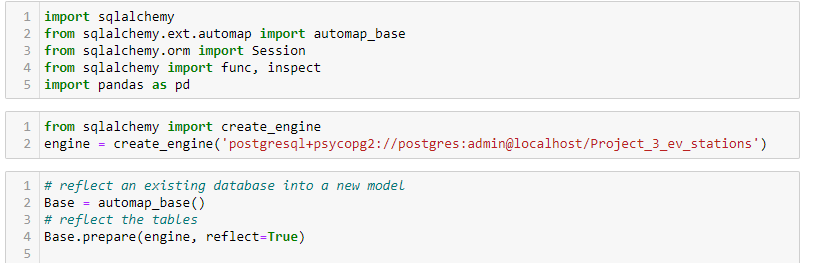
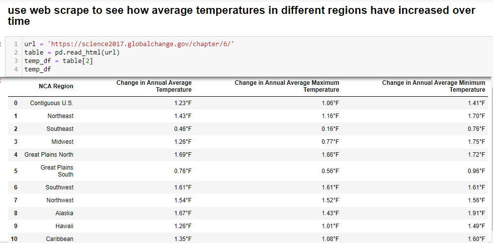
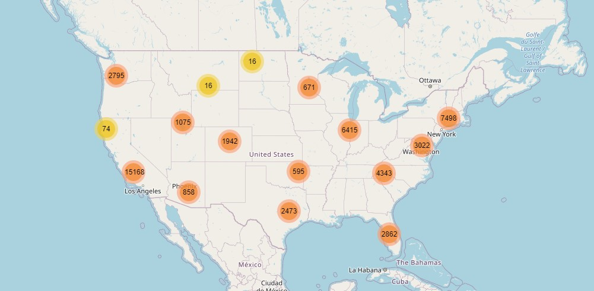

# US emissions and electric vehicle

Explore the relationship of US emissions and electric vehicle.

## Overview:

Analysis to show the states CO2 levels compare across the U.S and how many states are adopting electric vehicles by counting the number charging station installations.

### Rising CO2 and effects on the world

    - Using fossil fuels takes carbon from the ground, and burning it puts CO2 into the atmosphere. When there's more CO2 in the atmosphere, it makes the atmosphere warmer and trapping heat". https://cires.colorado.edu/outreach/resources/lesson/how-does-increase-co2-cause-increase-temperature
    - Scientist at NASA indicated that earth's average surface temperature has risen to 2.12 degrees Fahrenheit (1.18 degrees Celsius)

### How the US and States are tackling climate change

    - The Federal government signed legislation that increase renewable energy and accelerated policies for Zero Emission Vehicles.
    - Individual states commit to 100% clean energy by enacting climate-smart transportation policies

### Individuals looking to decrease their carbon footprint

    - Not only will help reduce emission but improve public health and improve eco-friendly.

## Project Outline:

### Data Collection:

- Sources:
  - [US and world CO2 emission](https://www.kaggle.com/manchunhui/world-co2-emissions-analysis) -.csv format
  - States CO2 emission - .csv format
  - [EV Charging Station](https://afdc.energy.gov/fuels/electricity_locations.html#/find/nearest?fuel=ELEC) - .json format

### Data Munging:

- Cleaned and consolidated the US, State emission and electric vehicle location data by Jupyter Notebook.
- Imported and cleaned data file to PostregSQL by using Jupyter Notebook.
- Database was created in SQLite with Flask route to store the aggregate data.

### Data Visuals:

- Used Leaflet and D3 to generated the visuals from database.
- Used Python Flask, API, HTML/CSS, JavaScript for creating a webpage and display visualizations graph.
- Deploy app to Heroku:

### US map and EV station:

